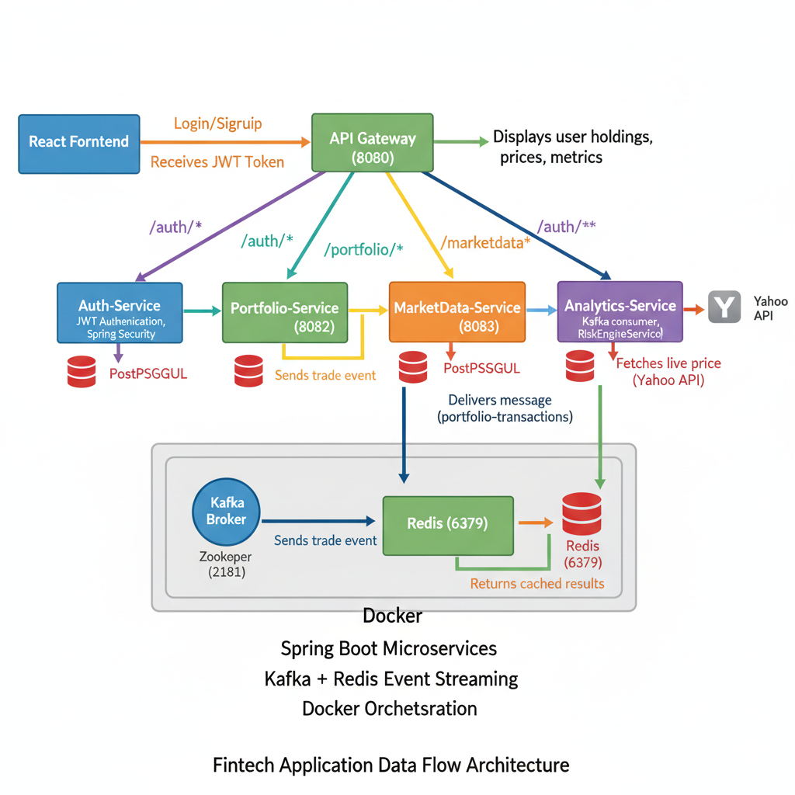

---

# 🧠 TradeLens – Java Microservices + React

### 🚀 Fintech Stock Portfolio Management System

A full-stack **microservices-based fintech application** that simulates a real-time trading ecosystem.
Built using **Spring Boot (Java)** for backend microservices and **React.js** for frontend visualization.

---

## 🏗️ Project Architecture



> **Architecture Summary:**
> React Frontend → API Gateway → Microservices (Auth, Portfolio, Market Data, Analytics) → Kafka → Redis → PostgreSQL

---

## ⚙️ Tech Stack

| Layer          | Technology                                                       |
| -------------- | ---------------------------------------------------------------- |
| Frontend       | React.js, Axios, Chart.js, Tailwind CSS                          |
| Backend        | Java 17, Spring Boot, Spring Cloud Gateway, Spring Security, JPA |
| Database       | PostgreSQL                                                       |
| Messaging      | Apache Kafka + ZooKeeper                                         |
| Caching        | Redis                                                            |
| DevOps         | Docker Compose                                                   |
| Authentication | JWT (JSON Web Token)                                             |

---

## 🧩 Microservices Overview

| Service                    | Port | Description                                                  |
| -------------------------- | ---- | ------------------------------------------------------------ |
| 🔐 **Auth-Service**        | 8081 | User registration & login with JWT                           |
| 💼 **Portfolio-Service**   | 8082 | Manage transactions & holdings, publish trade events         |
| 📈 **Market-Data-Service** | 8083 | Fetch stock prices using Yahoo API, cache results with Redis |
| 🧮 **Analytics-Service**   | 8084 | Consume trade events via Kafka, perform risk calculations    |
| 🌐 **Gateway-Service**     | 8080 | Central entry point routing all API calls                    |

---

## 📡 API Endpoints

### 🔐 Auth-Service

| Method | Endpoint         | Description                      |
| ------ | ---------------- | -------------------------------- |
| POST   | `/auth/signup`   | Register a new user              |
| POST   | `/auth/login`    | Authenticate user and return JWT |
| GET    | `/auth/validate` | Validate JWT token               |

### 💼 Portfolio-Service

| Method | Endpoint                       | Description                          |
| ------ | ------------------------------ | ------------------------------------ |
| POST   | `/portfolio/add`               | Add stock transaction (requires JWT) |
| GET    | `/portfolio/holdings/{userId}` | Retrieve user portfolio holdings     |

### 📈 Market-Data-Service

| Method | Endpoint                     | Description                             |
| ------ | ---------------------------- | --------------------------------------- |
| GET    | `/marketdata/health`         | Health check                            |
| GET    | `/marketdata/price/{symbol}` | Get live stock price (cached via Redis) |

### 🧮 Analytics-Service

| Method | Endpoint                   | Description                           |
| ------ | -------------------------- | ------------------------------------- |
| GET    | `/analytics/health`        | Check if service is running           |
| GET    | `/analytics/risk/{userId}` | Get risk metrics and exposure details |

---

## 🔄 Data Flow

1. User logs in via **React Frontend** → gets **JWT token**
2. API Gateway routes requests:

    * `/auth/*` → Auth-Service
    * `/portfolio/*` → Portfolio-Service
    * `/marketdata/*` → MarketData-Service
    * `/analytics/*` → Analytics-Service
3. Portfolio events are published to **Kafka**
4. Analytics-Service consumes trade events and performs calculations
5. Market-Data-Service fetches and caches live data via **Redis**
6. Results displayed in the React dashboard with charts and insights

---

## 🧠 Features

✅ JWT Authentication & Authorization
✅ Kafka-based asynchronous communication
✅ Redis Caching for Market Data
✅ Real-time Portfolio Analytics
✅ RESTful APIs for all microservices
✅ Centralized Routing via Spring Cloud Gateway
✅ Interactive Frontend Dashboard with React & Chart.js

---

## 🧪 Testing Steps (Localhost)

### Start Supporting Services

```bash
# Start Zookeeper
zookeeper-server-start.bat config/zookeeper.properties

# Start Kafka Broker
kafka-server-start.bat config/server.properties

# Start Redis
redis-server
```

### Run Microservices

Each microservice can be started with:

```bash
mvn spring-boot:run
```

Run in this order:

1. Auth-Service (8081)
2. Portfolio-Service (8082)
3. Market-Data-Service (8083)
4. Analytics-Service (8084)
5. Gateway-Service (8080)

### Frontend Setup

```bash
cd frontend
npm install
npm start
```

App runs on **[http://localhost:3000](http://localhost:3000)**

---

## 🧾 Example API Flow

```bash
# Register
POST http://localhost:8080/auth/signup
{
  "name": "Vikas Singh",
  "email": "vikas@example.com",
  "password": "123456"
}

# Login → Receive JWT token
POST http://localhost:8080/auth/login

# Add portfolio transaction
POST http://localhost:8080/portfolio/add
Headers: Authorization: Bearer <token>
{
  "userId": 1,
  "symbol": "AAPL",
  "quantity": 10,
  "price": 180.5,
  "type": "BUY"
}

# Get holdings
GET http://localhost:8080/portfolio/holdings/1
```

---

## 📊 Frontend Pages

| Page           | Description                |
| -------------- | -------------------------- |
| Login / Signup | User authentication        |
| Dashboard      | Overview of portfolio      |
| Transactions   | Manage trade records       |
| Market Data    | Live price updates         |
| Insights       | Risk analytics and metrics |

---

## 🐳 Docker Setup (Optional)

If you have Docker installed, create a `docker-compose.yml` to run:

* PostgreSQL
* Redis
* Zookeeper
* Kafka
* All backend microservices

```bash
docker-compose up --build
```

---

## 🧾 Proof of Work

✅ Backend microservices functional
✅ Kafka, Redis, and PostgreSQL verified
✅ React frontend connected via Gateway
✅ Complete API testing done with Postman

---

## 👨‍💻 Author

**Vikas Singh**
🎓 Dr. D. Y. Patil College of Engineering & Innovation, Pune
💼 GitHub: [vikassingh5522](https://github.com/vikassingh5522)

---

### 🏁 Tags

`#Java` `#SpringBoot` `#React` `#Microservices` `#Kafka` `#Redis` `#Fintech` `#Docker`

---

